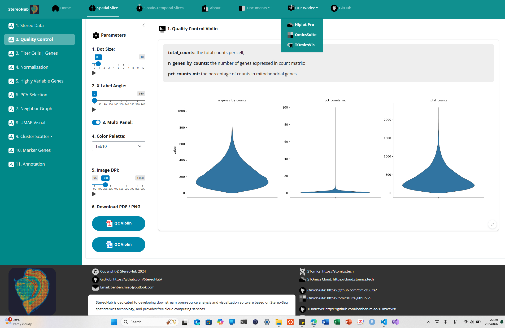

## 1. StereoHub

### 1.1 StereoHub Introduction:

**StereoHub: An interactive cloud platform for downstream analytics at Stereo-Seq.** The `StereoHub` user interface is designed and developed based on the `Shiny v1.0.0` framework of `Python v3.8.10`, providing rich web components for data manipulation, function parameters, and result display, making data analytics parameters as completely intuitive as possible for scientists. The functions of `StereoHub` for Stereo-Seq spatiotemics data analytics are realized by important functional modules such as `stereopy v3.1.3`, `anndata v0.9.2`, `biopython v1.83.0`, `hdf5 v1.14.0`, `panel v0.14.4`, `bokeh v2.4.3`, `plotly v5.23.0`, etc. Thanks to these excellent open-source modules.



[***a. Github Team: https://github.com/StereoHub/***](https://github.com/StereoHub/)

[***b. Source Repository: https://github.com/StereoHub/StereoHub***](https://github.com/StereoHub/StereoHub)

[***c. Documents: https://stereohub.github.io***](https://stereohub.github.io)

[***d. Cloud Platform: https://hiplot.com.cn/stereohub***](https://hiplot.com.cn/stereohub)

---

### 2.1 Stereo-Seq Technology:

[***a. STomics Stereo-Seq: https://stomics.tech***](https://stomics.tech)

[***b. STomics Cloud: https://cloud.stomics.tech***](https://cloud.stomics.tech)

[***c. STOmics Database: https://db.cngb.org/stomics/***](https://db.cngb.org/stomics/)

[***d. ImageStudio, StereoMap: https://stomics.tech/products/BioinfoTools/OfflineSoftware***](https://stomics.tech/products/BioinfoTools/OfflineSoftware)

[***e. STomics Github: https://github.com/STOmics/***](https://github.com/STOmics/)

[***f. Stereopy: https://github.com/STOmics/Stereopy/***](https://github.com/STOmics/Stereopy/)

## 2. For User

### 2.1 StereoHub Cloud `Come soon`

[StereoHub Cloud: https://stereohub.github.io/stereohub/](https://stereohub.github.io/stereohub/)

## 3. For Developer

### 3.1 Installing

```bash
# 1. git clone repository
git clone git@github.com:StereoHub/StereoHub.git
cd StereoHub

# 2. Install Environment
# 2.1 For Windows
.\env-win.bat

# 2.2 For Linux
bash env-linux.sh

# 2.3 Install Steps
# 2.3.1 Mamba Env Create and Activate
mamba create -n stereohub python=3.8
mamba activate stereohub

# 2.3.2 Shiny
mamba install -c conda-forge shiny=1.0.0 shinywidgets=0.3.2 IPython=8.12.2 ipywidgets=8.1.3

# 2.3.3 Utils
mamba install -c conda-forge numpy=1.23.5 pandas=1.5.3 matplotlib=3.7.1 faicons=0.2.2

# 2.3.4 Stereopy
mamba install stereopy=1.3.1 -c stereopy -c grst -c numba -c conda-forge -c bioconda -c fastai -c defaults

# 2.4 Conda Env Export and Create
conda env create -f stereohub.yml
conda activate stereohub
```

### 3.2 Development

```bash
# 1. For Windows
.\start-win.bat

# 2. For Linux
bash start-linux.sh

# 3. All Terminals
python -m shiny run \
  --host 127.0.0.1 \
  --port 5000 \
  --reload \
  --reload-includes "*.py,*.css,*.js,*.html,*.md" \
  --reload-excludes "*.png,*.pdf" \
  --log-level info \
  --app-dir "." \
  --launch-browser \
  --dev-mode \
  app.py
```

### 3.3 Deploy: Shinylive (WebAssembly + Pyodide)
- [**Shinylive: Shiny + WebAssembly**: https://shiny.posit.co/py/docs/shinylive.html](https://shiny.posit.co/py/docs/shinylive.html)

```bash
shiny create myapp

pip install shinylive
shinylive export myapp site
python3 -m http.server --directory site 8008
```

### 3.4 Deploy: Self Host
- [**Self-hosted deployments**: https://shiny.posit.co/py/docs/deploy-on-prem.html](https://shiny.posit.co/py/docs/deploy-on-prem.html)

```python
if __name__ == "__main__":
    run_app(
        app="app",
        host="0.0.0.0",
        port=5000,
        autoreload_port=0,
        reload=True,
        reload_dirs=None,
        reload_includes="*.py,*.css,*.js,*.html,*.md",
        reload_excludes="*.png,*.pdf",
        ws_max_size=16777216,
        log_level=None,
        app_dir=".",
        factory=False,
        launch_browser=False,
        dev_mode=False,
    )
```

```yml
python /usr/bin/python3;
run_as shiny;

server {
  listen 3838;

  # Define a location at the base URL
  location / {
    # Host the directory of Shiny Apps stored in this directory
    site_dir /srv/shiny-server;

    # Log all Shiny output to files in this directory
    log_dir /var/log/shiny-server;

    # An index of the applications available in this directory will be shown.
    directory_index on;
  }
}
```

## 4. References

> Ao Chen, Sha Liao, Mengnan Cheng, Longqi Liu, Xun Xu, Jian Wang. **Spatiotemporal transcriptomic atlas of mouse organogenesis using DNA nanoball-patterned arrays.** ***Cell***, 2022, doi: **https://doi.org/10.1016/j.cell.2022.04.003**